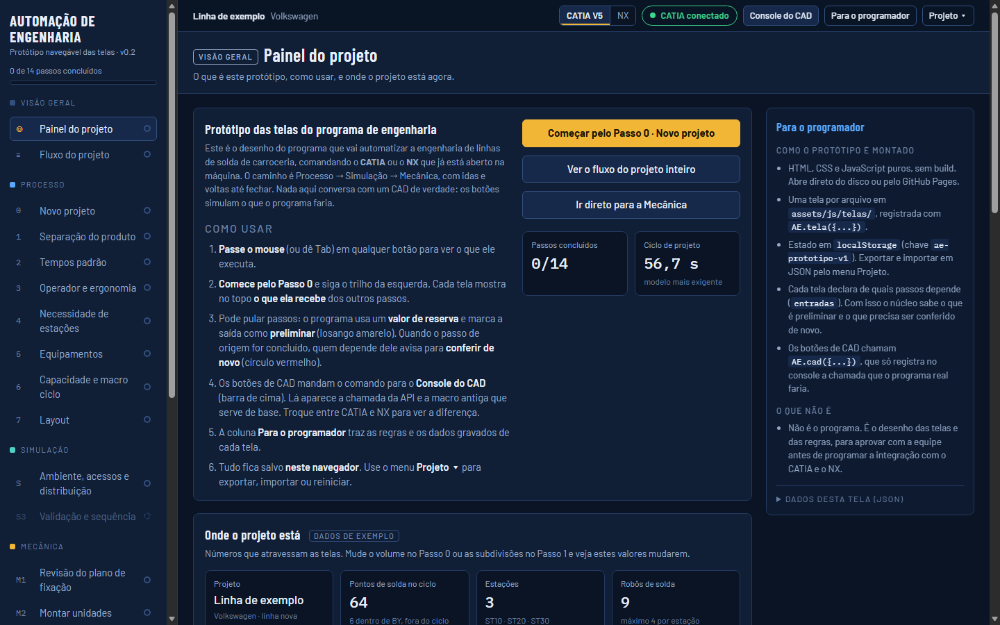
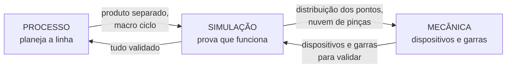
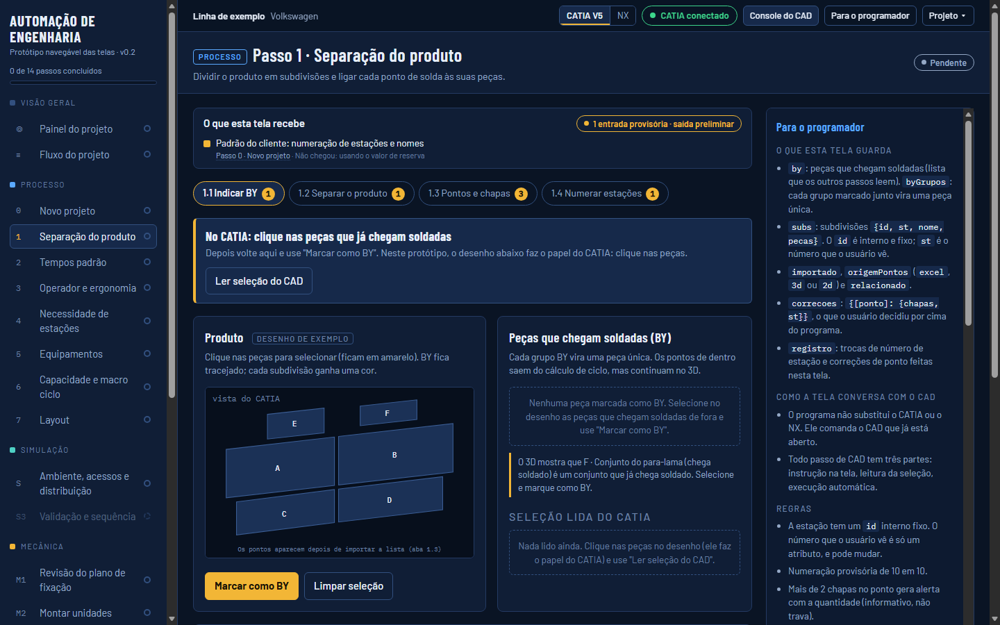
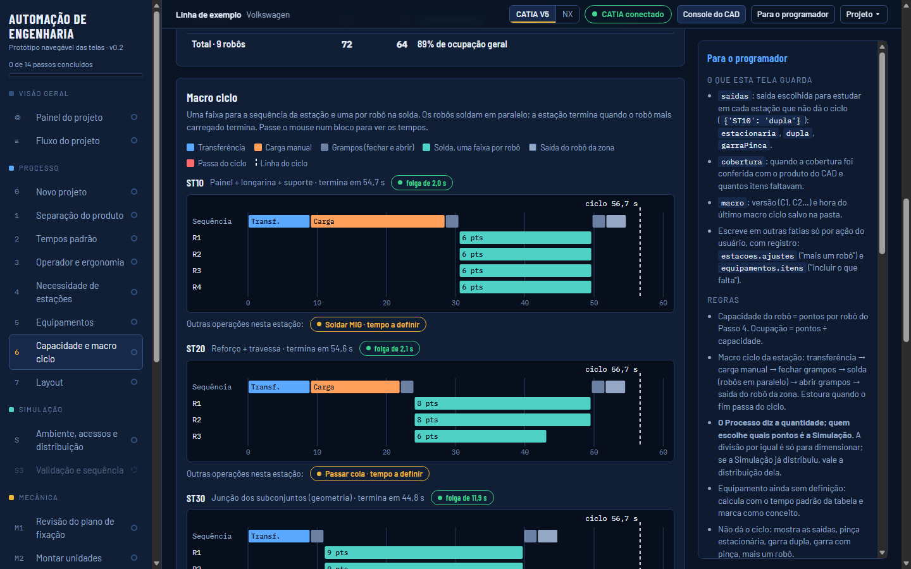
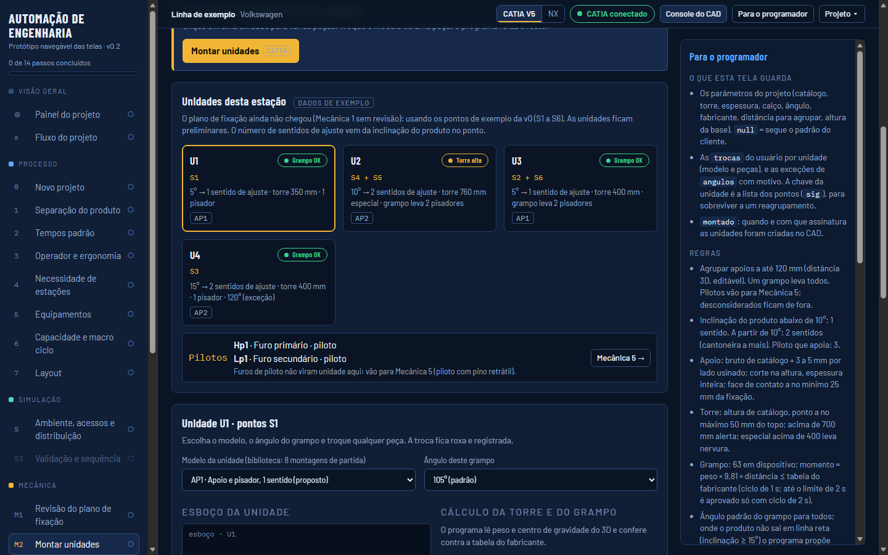
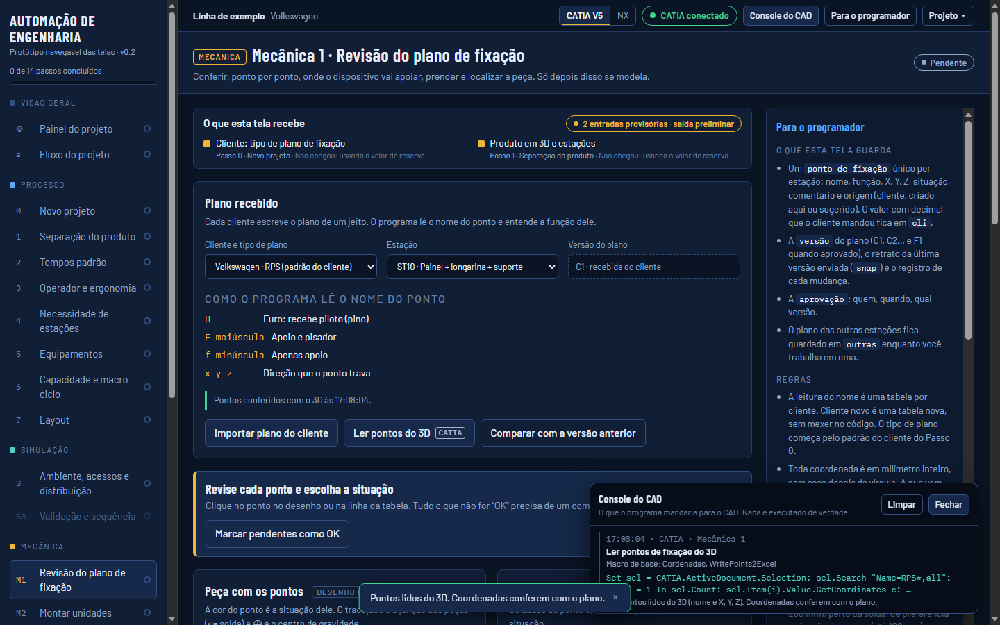

# Automação de Engenharia · Processo, Simulação e Mecânica

> Programa para automatizar a engenharia de linhas de solda de carroceria, comandando o **CATIA V5** e o **Siemens NX** que já estão abertos na máquina do projetista.

[](#onde-estamos)
[](https://herondsx.github.io/Projeto-Automacao-de-manufatura/)
[](docs/integracao-cad.md)
[](docs/integracao-cad.md)

### ▶ [Abrir o protótipo navegável](https://herondsx.github.io/Projeto-Automacao-de-manufatura/)



---

## A ideia em poucas linhas

Projetar uma linha de solda passa por três áreas que trocam informação o tempo todo: o **Processo** planeja a linha, a **Simulação** prova que funciona e a **Mecânica** projeta os dispositivos e as garras. Hoje muito disso é feito à mão no CAD, com macros soltas, planilhas e conferência no olho, e cada montadora tem um padrão diferente.

O programa **conduz o projeto em passos**, comanda o CAD aberto para fazer o trabalho repetitivo e **confere sozinho** o que hoje se confere no olho: volumes e ciclos, chapas por ponto, cobertura do produto, acesso de parafuso, cálculo do grampo, distâncias mínimas, colisão com a nuvem de pinças.



Princípios que guiam tudo (detalhes em [docs/visao-geral.md](docs/visao-geral.md)):

- **O programa não substitui o CAD**: instrução na tela, leitura da seleção, execução automática.
- **Entrada que não chegou não trava o passo**: roda com valor de reserva e a saída fica preliminar, para conferência.
- **O padrão do cliente é cadastro, não código**: nomes de arquivo, pastas, tempos, catálogos, plano de fixação.
- **Tudo o que o programa propõe pode ser editado, e a edição fica registrada.**
- **Versões C1, C2… (conceito) e F1 (final, com aprovação registrada).**
- **Coordenadas sempre em milímetro inteiro. O usuário nunca escolhe onde salvar.**

## O protótipo

O [protótipo](https://herondsx.github.io/Projeto-Automacao-de-manufatura/) é o desenho das telas e das regras, para a equipe aprovar **antes** de programar a integração com o CAD. Ele parte da v0 desenhada pelo Bruno ([guardada aqui](prototipo/original/telas-bruno-v0.html)) e acrescenta:

- **todas as telas do fluxo principal**, do Passo 0 até a Mecânica, ligadas entre si: mudar o volume no Passo 0 muda as estações, os robôs e o macro ciclo;
- o **grafo de passos funcionando**: cada tela mostra o que recebe dos outros passos; pular um passo deixa a saída **preliminar**; concluir de novo um passo de origem pede para **conferir de novo** quem depende dele;
- **CATIA ou NX**: troque na barra de cima. Cada botão de CAD manda para o **Console do CAD** a chamada da API (COM ou NXOpen) e a macro antiga que serve de base;
- **coluna "Para o programador"** em cada tela, com regras, saídas, perguntas em aberto e os dados gravados;
- projeto salvo no navegador, com **exportar e importar** em JSON.

| Área | Telas |
| --- | --- |
| Visão geral | Painel do projeto · Fluxo do projeto |
| Processo | 0 Novo projeto · 1 Separação do produto · 2 Tempos padrão · 3 Operador e ergonomia · 4 Necessidade de estações · 5 Equipamentos · 6 Capacidade e macro ciclo (com 6.1 Cobertura) · 7 Layout |
| Simulação | S Ambiente, acessos e distribuição |
| Mecânica | M1 Revisão do plano de fixação · M2 Montar unidades · M3 Conferir alertas · M4 Desenhos e listas · M5 Outras unidades e garras |
| A fazer | 8 Segurança · 9 Ciclograma · 10 Fundação · 11 Grades, calhas e armários · 12 Folha de instrução · S3 Validação e sequência |

Descrição de cada tela em [docs/telas.md](docs/telas.md).

| | |
| --- | --- |
|  |  |
| **Passo 1 · Separação do produto**: BY, subdivisões e pontos ligados às peças | **Passo 6 · Macro ciclo**: capacidade por robô e Gantt de cada estação |
|  |  |
| **Mecânica 2 · Montar unidades**: unidades calculadas dos pontos aprovados | **Console do CAD**: a chamada que iria para o CATIA ou o NX |

### Abrir no seu computador

Não precisa instalar nada: baixe o repositório e abra `prototipo/index.html` no navegador.

```bash
git clone https://github.com/Herondsx/Projeto-Automacao-de-manufatura.git
```

A cada push na `main` que mexa em `prototipo/`, o GitHub Actions publica a versão nova no GitHub Pages.

## Onde estamos

| Fase | Situação |
| --- | --- |
| 0 · Desenho das telas e regras (v0 do Bruno) | feito |
| 0.2 · Protótipo navegável com todas as telas do fluxo principal ligadas | feito, **em revisão pela equipe** |
| 1 · Primeiro corte com CAD de verdade (Passo 1 no CATIA) | a começar |
| 2 · Mecânica M1 e M2 com CAD de verdade | — |

Próximos passos e perguntas que a equipe precisa responder: [docs/roadmap.md](docs/roadmap.md).

## Estrutura do repositório

```
├── prototipo/              protótipo navegável (publicado no GitHub Pages)
│   ├── index.html
│   ├── assets/             css, js (núcleo, dados de exemplo, uma tela por arquivo)
│   └── original/           v0 do Bruno, como referência
├── docs/                   visão, fluxo, telas, arquitetura, integração com CAD, glossário
├── src/
│   ├── catia/              código e macros para o CATIA V5
│   └── nx/                 código e journals para o NX
└── .github/workflows/      publicação do protótipo
```

## Documentação

| Documento | Para quem | Conteúdo |
| --- | --- | --- |
| [Visão geral](docs/visao-geral.md) | todos | problema, proposta, princípios |
| [Fluxo do projeto](docs/fluxo.md) | todos | cada passo: o que recebe, o que faz se não receber, o que entrega |
| [Telas](docs/telas.md) | todos | o que cada tela do protótipo faz |
| [Glossário](docs/glossario.md) | todos | BY, RPS, NAAMS, MTM, nuvem de pinças, DR01… |
| [Roadmap e perguntas em aberto](docs/roadmap.md) | todos | próximos passos e decisões pendentes |
| [Arquitetura proposta](docs/arquitetura.md) | programação | camadas, adaptador de CAD, opções de tecnologia |
| [Integração com CAD](docs/integracao-cad.md) | programação | COM do CATIA, NXOpen, macros antigas de base |
| [Como o protótipo é montado](docs/prototipo.md) | programação | contrato das telas, estado, `AE.calc` |
| [Referências](docs/referencias.md) | todos | o que aprendemos com projetos reais (sem dados de cliente) |

## Regra de ouro do repositório

O repositório é **público**. Arquivo de cliente (CAD, planilha, PDF, desenho, lista de pendências) **nunca** entra aqui. O `.gitignore` bloqueia os formatos mais comuns. Veja [CONTRIBUTING.md](CONTRIBUTING.md).

## Equipe

| Nome | Papel |
| --- | --- |
| Bruno Oliva | Design leader · projetista (CATIA e NX) · autor do desenho das telas |
| Nelson | Projetista (CATIA e NX) |
| Heron de Souza | Desenvolvedor |

## Licença

Ainda não definida. Até lá, todos os direitos são reservados aos autores.
