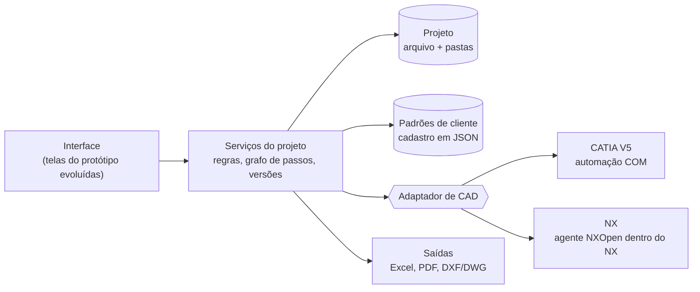

# Arquitetura proposta (para discussão)

> Este documento é uma **proposta** para o programa real. Nada aqui está decidido. Cada decisão fica registrada no fim, com quem decidiu e quando.

## Camadas



| Camada | Responsabilidade | Não pode |
| --- | --- | --- |
| Interface | Mostrar o passo, coletar decisões, explicar cada botão | Ter regra de negócio ou chamar o CAD direto |
| Serviços | Regras (ciclo, estações, agrupamento de apoios, cálculo de grampo…), grafo de passos, versões C/F, registro de edições | Saber se o CAD é CATIA ou NX |
| Adaptador de CAD | Traduzir pedidos ("ler seleção", "criar subconjunto", "ler pontos", "inserir peça de catálogo") para a API do CAD | Ter regra de projeto |
| Padrões de cliente | Nomes de arquivo, pastas, tempos, catálogos, leitura do plano de fixação | Ficar escrito no código |

## Pontos de atenção técnicos

- **CATIA V5 por COM**: dá para comandar de fora do CATIA, pegando a instância aberta (`CATIA.Application`). Em .NET, usa os interops gerados das type libraries do CATIA. No .NET 5 ou mais novo, `Marshal.GetActiveObject` não existe mais e precisa de P/Invoke (`oleaut32`), ou o projeto fica em .NET Framework 4.8.
- **NX por NXOpen**: o código normalmente roda **dentro** do NX. Para a interface conversar com ele, a proposta é um pequeno **agente** carregado no NX (DLL ou journal na inicialização) que recebe pedidos por um canal local (named pipe ou HTTP em `localhost`). A versão do .NET e do Python aceitas depende da versão do NX instalada.
- **Licenças**: automação COM do CATIA e NXOpen exigem as licenças certas nas máquinas dos projetistas (confirmar com a TI de cada cliente/planta).
- **DWG**: ler e gravar DWG exige biblioteca paga (ODA) ou o próprio AutoCAD. DXF tem bibliotecas livres (ex.: netDxf). Decidir se o layout sai em DXF.
- **Excel**: bibliotecas livres resolvem (ex.: ClosedXML no .NET, openpyxl no Python).

## Opções para a interface

| Opção | Prós | Contras |
| --- | --- | --- |
| **A. App desktop .NET com WebView2** usando o HTML/CSS das telas do protótipo | Reaproveita o protótipo; o Bruno continua desenhando em HTML; o .NET fala COM e NXOpen sem gambiarra | Duas tecnologias (web na tela, .NET no resto) |
| B. App desktop .NET nativo (WPF ou WinUI) | Uma tecnologia só | Refazer todas as telas; iteração de interface mais lenta |
| C. Python + interface web local (pywebview) | `pywin32` fala COM; NXOpen tem Python | Distribuir Python nas máquinas da planta; COM em Python é mais frágil |

**Recomendação inicial:** opção A. O protótipo vira a interface real aos poucos, e o núcleo de regras fica em .NET, testável sem CAD.

## Estrutura de código sugerida

```
src/
├── app/          interface (WebView2 + telas)
├── core/         regras do projeto, grafo de passos, versões, padrões de cliente
├── cad/
│   ├── catia/    adaptador COM + macros legadas de referência
│   └── nx/       adaptador + agente NXOpen
├── saidas/       Excel, PDF, DXF
└── padroes/      cadastro de clientes (sem dado confidencial)
```

## Primeiro corte vertical sugerido

Um caminho pequeno, de ponta a ponta, que já economiza tempo e prova a arquitetura:

1. **Passo 1 com CATIA de verdade**: ler a seleção, criar o Product da subdivisão, importar a lista de pontos do Excel do cliente e contar chapas pela geometria.
2. Gravar o projeto e o registro de edições.
3. Exportar o plano de pontos por estação no padrão de um cliente.

Depois disso, M1 (revisão do plano de fixação), que já tem as macros `Cordenadas` e `WritePoints2Excel` como base.

## Decisões

| Data | Decisão | Quem |
| --- | --- | --- |
| — | Nenhuma ainda. | — |
