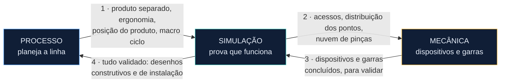

# Fluxo do projeto

O caminho inteiro de um projeto de linha de solda: o que entra em cada passo, o que o programa faz quando a informação não chega, e onde há revisão. O conteúdo deste documento é o mesmo da tela **Fluxo do projeto** do protótipo, escrito pelo Bruno na v0.

## Os laços entre as áreas

O projeto não anda em linha reta. Ele vai e volta entre as três áreas até fechar.

Se a validação achar problema (colisão, ponto sem acesso, ciclo que não fecha), o trabalho volta para a área anterior e o laço gira de novo. Cada giro gera uma versão, e o programa mostra o que mudou desde a anterior.

## Regras do fluxo

- Cada passo declara suas **entradas**, sua **saída** e de quais passos depende.
- Toda saída tem estado: conceito (`C1`, `C2`…) ou final (`F1`).
- Entrada que não chegou **não trava** o passo: ele roda com o valor de reserva e a saída fica **preliminar**, marcada "para conferência".
- Quando a entrada chega, o programa avisa quais passos precisam ser **conferidos de novo**.
- Passo com revisão de fora só vira final com a aprovação registrada: quem aprovou e quando.

## Quando chega uma revisão

Nada é refeito do zero. O programa compara a versão nova com a anterior e mostra só o que mudou.

| O que chegou | O que o programa faz | Quem trata |
| --- | --- | --- |
| Produto novo do cliente | Registra a mudança, compara as superfícies no 3D e compara pontos de solda, cola e pinos. Depois roda a cobertura de novo | Processo |
| Plano de fixação novo | Reabre só os pontos que mudaram e pede nova aprovação | Mecânica |
| Nuvem de pinças nova | Mostra as unidades do dispositivo que passaram a colidir | Mecânica |
| Layout alterado | Confere cabos, mangueiras, grades e avisa a Simulação | Processo |
| Troca de número de estação | Atualiza todos os documentos e guarda o registro | Todos |
| Comentário do cliente em revisão | Vira pendência com dono e prazo, até ser fechada | Quem recebeu |

## Passo a passo

### A · Abertura

#### 0 · Novo projeto Processo

| Precisa receber | De quem |
| --- | --- |
| Cliente, nome do projeto, linha nova ou retooling | Usuário |
| Carros por hora e por dia, de cada modelo | Cliente |
| Turnos, horas por turno, disponibilidade | Cliente |
| Layout de partida | Cliente ou vendas |
| Padrão do cliente: pastas, nomes, normas | Cadastro do cliente |

**Se não receber:**

- Sem layout de partida: começa do zero e o programa sugere as estações.
- Cliente sem estrutura de pastas cadastrada: usa a estrutura padrão do programa.
- Volumes não fecham: não cria o projeto e mostra a conta.

**Entrega:** Projeto criado, pastas criadas, tempo de ciclo por modelo.

### B · Processo, primeira passada

#### 1 · Separação do produto Processo

| Precisa receber | De quem |
| --- | --- |
| Produto em 3D | Cliente |
| Lista de pontos: planilha, 3D ou desenho 2D | Cliente |
| Número de chapas por ponto | Cliente |
| O que já chega soldado (BY) | Usuário |

**Se não receber:**

- Sem planilha de pontos: lê os pontos direto do 3D ou do desenho 2D.
- Sem número de chapas: conta pela geometria e avisa onde há mais de 2.
- Sem número definitivo de estação: numera de 10 em 10 e troca depois, com registro.

**Entrega:** Subdivisões (um Product cada) com os pontos ligados às peças.  
**Revisão:** Produto revisado pelo cliente reabre este passo.

#### 2 · Tempos padrão Processo

| Precisa receber | De quem |
| --- | --- |
| Tabela de tempos do cliente | Cliente |
| Tempos do operador (MTM) | Usuário |

**Se não receber:**

- Cliente não tem tabela: usa a tabela de referência do programa, editável por projeto.
- MTM não preenchido: o posto manual fica sem tempo e aparece como pendente.

**Entrega:** Tabela de tempos do projeto.

#### 3 · Operador e ergonomia Processo

| Precisa receber | De quem |
| --- | --- |
| Modelo 3D do operador do projeto | Cliente |
| Posição do operador e lado da base | Usuário, no CAD |

**Se não receber:**

- Projeto sem modelo de operador: usa o operador de referência, de 173 cm.
- Alcance em zona amarela ou vermelha: pergunta se pode ajustar a posição.
- Item de manutenção acima de 1800 mm: pede plataforma.

**Entrega:** Postos manuais conferidos e apresentação de ergonomia.  
**Revisão:** Ergonomia é apresentada ao cliente para aprovação.

#### 4 · Necessidade de estações Processo

| Precisa receber | De quem |
| --- | --- |
| Pontos de geometria | Usuário ou fabricante |
| Estações já definidas, se houver | Cliente ou vendas |
| Subdivisões e tempos | Passos 1 e 2 |

**Se não receber:**

- Pontos de geometria não definidos: usa o mínimo de 2 por junção.
- Sem estações definidas: o programa sugere a quantidade.
- Estações definidas não dão o ciclo: mostra as opções: mais robôs ou mais estações.

**Entrega:** Quantidade de estações e de robôs, com a ordem de montagem.

#### 5 · Equipamentos Processo

| Precisa receber | De quem |
| --- | --- |
| Fornecedores homologados | Cliente |
| Peso das garras (payload) | Mecânica |
| Pinças existentes, no retooling | Levantamento da linha |

**Se não receber:**

- Peso da garra ainda não existe: lista preliminar, confirmada quando a Mecânica devolver o payload.
- Sem lista de homologados: usa a biblioteca do programa e marca para conferir.

**Entrega:** Lista de equipamentos por estação, preliminar.

#### 6 · Capacidade por robô e macro ciclo Processo

| Precisa receber | De quem |
| --- | --- |
| Tempo de ciclo de cada modelo | Passo 0 |
| Estações, robôs e tempos padrão | Passos 2, 4 e 5 |

**Se não receber:**

- Equipamento ainda sem definição: calcula com o tempo padrão da tabela e marca como conceito.
- Não dá o ciclo: mostra as saídas: pinça estacionária, garra dupla, garra com pinça, mais um robô.

**Entrega:** Quantos pontos cada robô e cada estação pode soldar, e o macro ciclo. O Processo diz a quantidade; quem escolhe quais pontos é a Simulação.

#### 6.1 · Cobertura do produto Processo

| Precisa receber | De quem |
| --- | --- |
| Tudo o que o produto contém: pontos, cola, pinos, furos, MIG | Passo 1 |
| Lista de equipamentos e operações | Passos 5 e 6 |

**Se não receber:**

- Produto pede algo que não tem equipamento: aponta a estação e propõe o equipamento que falta.
- Tem o equipamento mas não tem a operação: aponta a operação que falta no macro ciclo.

**Entrega:** Processo conferido: nada do produto ficou sem dono.  
**Revisão:** Roda de novo a cada revisão do produto.

#### 7 · Layout Processo

| Precisa receber | De quem |
| --- | --- |
| Desenho do prédio e zero predial | Cliente |
| Posição dos robôs | Simulação |
| Padrão de grade e de painéis | Cliente |
| Equipamentos | Passo 5 |

**Se não receber:**

- Posições da Simulação ainda não vieram: desenha o layout preliminar e atualiza quando chegarem.
- Mangueira de cola acima de 12 m ou cabo fora de 7, 15 ou 20 m: avisa e pede para mover o equipamento.
- Distância da grade abaixo da norma: mostra a altura de grade que resolve.

**Entrega:** Layout em DWG, com grades, painéis e plano de retirada de robô.  
**Revisão:** Layout é aprovado pelo cliente.

#### 8 · Lista de segurança Processo

| Precisa receber | De quem |
| --- | --- |
| Layout | Passo 7 |
| Postos manuais | Passo 3 |

**Se não receber:**

- Item da lista sem resposta: fica pendente e aparece no resumo.

**Entrega:** Lista de boas práticas preenchida.  
**Revisão:** A análise de risco oficial é aprovada por outro departamento.

### C · Simulação, primeira rodada

#### S0 · Levantamento da linha existente Simulação

| Precisa receber | De quem |
| --- | --- |
| Linha atual: robôs, pinças, programas | Cliente |

**Se não receber:**

- Linha nova: este passo é pulado.

**Entrega:** Relatório do estado da linha (só no retooling).

#### S1 · Montar o ambiente Simulação

| Precisa receber | De quem |
| --- | --- |
| Produto com os pontos, na posição definida | Processo, passos 1 e 3 |
| Equipamentos e layout, conforme forem ficando prontos | Processo, passos 5 e 7 |
| Biblioteca de robôs e pinças | Programa |

**Se não receber:**

- Equipamentos ainda não definidos: começa só com o produto e vai inserindo os equipamentos conforme chegam.
- Equipamento fora da biblioteca: usuário carrega o 3D e ele passa a fazer parte da biblioteca.
- Mais pinças que o limite do PLC: divide em mais de um estudo.

**Entrega:** Um estudo por PLC e zona, com tudo dentro da zona de segurança.  
**Revisão:** Cada equipamento novo ou revisado gera uma versão nova do estudo.

#### S2 · Acessos e distribuição dos pontos Simulação

| Precisa receber | De quem |
| --- | --- |
| Quantos pontos cabem em cada robô e estação | Processo, passo 6 |
| Pinças disponíveis | Biblioteca e fornecedores |
| Força máxima de cada pinça | Fabricante da pinça |

**Se não receber:**

- Ponto sem acesso: 1º redistribuir, 2º pinça nova, 3º troca de pinça.
- Robô não alcança: move o robô de 50 em 50 mm.
- Força da pinça nova não informada: segue e deixa um alerta para verificar depois.
- Pinça existente sem força suficiente: impede o ponto nessa pinça.
- Pontos não cabem na quantidade do Processo: devolve ao Processo com o motivo.

**Entrega:** Distribuição dos pontos (quais pontos em cada robô) e nuvem de pinças (JT e CGR), para a Mecânica modelar o 3D.  
**Revisão:** A Simulação é quem define quais pontos vão em cada robô.

### D · Mecânica

#### M1 · Revisão do plano de fixação Mecânica

| Precisa receber | De quem |
| --- | --- |
| Plano de fixação: RPS, Datum, PCM, PLP ou pré-método | Cliente |
| Produto em 3D da estação | Processo, passo 1 |

**Se não receber:**

- Cliente não enviou o plano: o usuário monta a proposta com a ajuda de "Sugerir pontos" e envia para aprovação.
- Cliente ainda não respondeu: a modelagem começa, mas fica preliminar.

**Entrega:** Pontos aprovados e lista de unidades a modelar.  
**Revisão:** Cliente revisa e aprova, ponto por ponto.

#### M2 · Montar unidades e 3D do dispositivo Mecânica

| Precisa receber | De quem |
| --- | --- |
| Pontos aprovados | M1 |
| Nuvem de pinças | Simulação, S2 |
| Padrão de construção (project book) | Cliente |
| Biblioteca de unidades | Programa |

**Se não receber:**

- Nuvem de pinças não chegou: modela assim mesmo e marca tudo para conferência.
- Chegou nuvem nova: mostra as unidades que colidem com as pinças.

**Entrega:** Dispositivo e garras em 3D, ligados ao 2D.

#### M3 · Peso, listas e sequência Mecânica

| Precisa receber | De quem |
| --- | --- |
| 3D do dispositivo e das garras | M2 |

**Se não receber:**

- Peso acima do robô escolhido: avisa o Processo para trocar o robô ou aliviar a garra.

**Entrega:** Payload, lista de materiais, sequência de abertura e fechamento.  
**Revisão:** Payload volta ao Processo e à Simulação.

#### M4 · Revisões de projeto do dispositivo Mecânica

| Precisa receber | De quem |
| --- | --- |
| 3D, listas e sequência | M2 e M3 |
| Resultado da simulação | Simulação, segunda rodada |

**Se não receber:**

- Cliente devolveu comentários: cada comentário vira uma pendência ligada à unidade.
- Simulação achou colisão: a unidade volta para ajuste.

**Entrega:** Dispositivo liberado para detalhar e fabricar.  
**Revisão:** Cliente revisa o dispositivo em três etapas: DR01, DR02 e DR03.

### E · Simulação, segunda rodada

#### S3 · Validação Simulação

| Precisa receber | De quem |
| --- | --- |
| 3D de dispositivos e garras | Mecânica, M2 |
| Payload | Mecânica, M3 |
| Macro ciclo | Processo, passo 6 |

**Se não receber:**

- Folga menor que a tabela: registra na folha de problemas e avisa a Mecânica.
- Tempo do robô estoura o ciclo: avisa o Processo.

**Entrega:** Folgas, trajetórias, áreas de interferência e segurança do robô conferidas.

#### S4 · Sequência completa da estação Simulação

| Precisa receber | De quem |
| --- | --- |
| Ciclograma | Processo, passo 9 |
| Sequência de abertura e fechamento | Mecânica, M3 |

**Se não receber:**

- Sequência não bate com o ciclograma: avisa na hora o Processo ou a Mecânica.
- Dispositivo ou garra mudou: a sequência precisa ser validada de novo.

**Entrega:** Vídeos e sequência validada com colisão ligada.  
**Revisão:** Só depois disso o dispositivo é liberado para fabricação.

#### S5 · Entregas da Simulação Simulação

| Precisa receber | De quem |
| --- | --- |
| Tudo o que foi validado | S3 e S4 |

**Se não receber:**

- Entrega faltando: aparece na lista de conferência da etapa.

**Entrega:** Pacote de entregas da Simulação.  
**Revisão:** Cliente revisa em três etapas: DR01, DR02 e DR03.

### F · Fechamento do Processo

#### 9 · Ciclograma Processo

| Precisa receber | De quem |
| --- | --- |
| Tempos reais dos robôs | Simulação, S3 |
| Sequência do dispositivo | Mecânica, M3 |

**Se não receber:**

- Tempos reais ainda não vieram: mantém o macro ciclo como referência.
- Não dá o ciclo: gera alerta e mostra as opções.

**Entrega:** Ciclograma detalhado de cada estação.

#### 10 · Fundação Processo

| Precisa receber | De quem |
| --- | --- |
| Layout final | Passo 7 |
| Cargas dos equipamentos | Fabricantes |

**Se não receber:**

- Carga não informada: usa a do catálogo e marca para conferir.

**Entrega:** Plano de fundação.

#### 11 · Grades, calhas e armários Processo

| Precisa receber | De quem |
| --- | --- |
| Layout final | Passo 7 |
| Padrão de grade | Cliente |
| O que passa em cada calha | Passo 5 |

**Se não receber:**

- Vão que não fecha com módulo padrão: usa módulo especial só na sobra.

**Entrega:** Planos de grade, calhas e armário, com as listas.

#### 12 · Folha de instrução e pacote final Processo

| Precisa receber | De quem |
| --- | --- |
| 3D final | Mecânica e Simulação |
| Ciclograma | Passo 9 |

**Se não receber:**

- Imagem automática não ficou boa: o usuário troca a imagem.

**Entrega:** Folhas de instrução, planos de pontos, cola e pinos, e a árvore do projeto.  
**Revisão:** Pacote entregue ao cliente.

