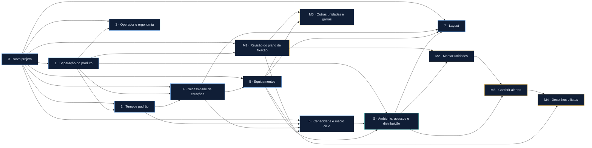

# Telas do protótipo

Cada tela abaixo existe no [protótipo navegável](https://herondsx.github.io/Projeto-Automacao-de-manufatura/). O texto desta página é gerado a partir do próprio código das telas (a coluna **Para o programador** de cada uma), então protótipo e documento dizem a mesma coisa.

## Quem depende de quem

Cada seta é uma entrada declarada pela tela: a tela da ponta da seta usa a saída da tela de origem. Se a origem não foi concluída, a tela usa um valor de reserva e a saída dela fica **preliminar**.

## Painel do projeto

Visão geral · [abrir no protótipo](https://herondsx.github.io/Projeto-Automacao-de-manufatura/#/painel)

O que é este protótipo, como usar, e onde o projeto está agora.

**Como o protótipo é montado:**

- HTML, CSS e JavaScript puros, sem build. Abre direto do disco ou pelo GitHub Pages.
- Uma tela por arquivo em assets/js/telas/, registrada com AE.tela({...}).
- Estado em localStorage (chave ae-prototipo-v1). Exportar e importar em JSON pelo menu Projeto.
- Cada tela declara de quais passos depende (entradas). Com isso o núcleo sabe o que é preliminar e o que precisa ser conferido de novo.
- Os botões de CAD chamam AE.cad({...}), que só registra no console a chamada que o programa real faria.

**O que NÃO é:**

- Não é o programa. É o desenho das telas e das regras, para aprovar com a equipe antes de programar a integração com o CATIA e o NX.

## Fluxo do projeto

Visão geral · [abrir no protótipo](https://herondsx.github.io/Projeto-Automacao-de-manufatura/#/fluxo)

O caminho inteiro: o que entra em cada passo, o que o programa faz quando a informação não chega, e onde há revisão.

**O que esta tela guarda:**

- Só o filtro de área escolhido (area), como estado de tela. Nenhum dado do projeto.

**O fluxo é um grafo:**

- Cada passo declara suas entradas, sua saída e de quais passos depende.
- Toda saída tem estado: conceito (C1, C2…) ou final (F1).
- Entrada que não chegou não trava o passo. Ele roda com o valor de reserva e a saída fica preliminar, marcada "para conferência".
- Quando a entrada chega, o programa avisa quais passos precisam ser conferidos de novo.

**Como o protótipo implementa o grafo:**

- Cada tela declara entradas: [{de, o}]. O núcleo mostra isso no topo da tela, na faixa "O que esta tela recebe".
- AE.origem(id) diz de onde vem cada entrada: tela (passo concluído), andamento (parcial) ou reserva (nada ainda; AE.calc.* devolve o valor de reserva).
- Concluir com alguma entrada que não seja tela grava o passo como preliminar (losango amarelo).
- Cada conclusão ganha um número de sequência. Se um passo de origem for concluído depois do dependente, o dependente fica conferir de novo (círculo vermelho) e mostra a faixa "Entrada mudou".
- Alterar um passo concluído o devolve para "em andamento" e fica no registro.
- O mapa passo → tela fica neste arquivo (TELAS). O passo atual é o primeiro do fluxo cuja tela existe e não está concluída nem preliminar.

**Revisões:**

- Todo arquivo, recebido ou gerado, tem versão e data.
- Nome da versão: conceito é C1, C2, C3… Final é F1, F2… O ideal é existir só o F1.
- Passar de C para F exige a aprovação registrada. Mudança depois do F1 cria F2 e pede o motivo.
- Nova versão gera uma lista de diferenças: o que entrou, saiu e mudou de lugar.
- Passo com revisão de fora só vira final com a aprovação registrada: quem aprovou e quando.

**Cobertura do produto:**

- Tabela conteúdo do produto → equipamento + operação, por projeto, e que aceita novas linhas.
- Roda sozinha depois da capacidade por robô e a cada revisão do produto.
- Item sem cobertura impede a liberação do processo.
- No protótipo ela mora no Passo 6.1 (tela da capacidade). Aqui é só leitura de AE.calc.cobertura().

**Saída:**

- Nenhuma. Tela de leitura: usa AE.telas, AE.statusVisivel, AE.origem, AE.calc.cobertura(), AE.calc.simulacao() e AE.calc.projeto().

**Macros de base:**

- Nenhuma. Esta tela não conversa com o CAD.

## Passo 0 · Novo projeto

Processo · [abrir no protótipo](https://herondsx.github.io/Projeto-Automacao-de-manufatura/#/inicio)

Tudo o que o programa precisa saber antes de qualquer cálculo: cliente, volumes, turnos, layout de partida e pastas.

**O que esta tela guarda:**

- Um registro de projeto com cliente, tipo de linha, turnos, horas e disponibilidade.
- Uma lista de modelos, cada um com volume e ciclo (e o motivo, se o ciclo adotado for menor).
- A estrutura de pastas e a pasta de destino de cada tipo de documento.

**Regras:**

- Ciclo calculado = (3600 ÷ carros por hora) × disponibilidade.
- Conferência: carros/hora × turnos × horas tem de bater com carros/dia (tolerância de 1%).
- O ciclo adotado pode ser menor que o calculado, mas pede um motivo.
- O projeto só é criado sem nenhuma conferência em vermelho.
- O padrão do cliente (tempos, normas, nomes, catálogo, plano de fixação) é carregado de um cadastro, nunca fixo no código.
- Os passos seguintes dimensionam pelo menor ciclo adotado (o modelo mais exigente).

**Saída:**

- AE.calc.projeto(): cliente, padrão do cliente, turnos, horas, disponibilidade, modelos com ciclo e cicloAlvo.

**Macros de base:**

- Nenhuma. Esta tela é só cadastro e cálculo.

## Passo 1 · Separação do produto

Processo · [abrir no protótipo](https://herondsx.github.io/Projeto-Automacao-de-manufatura/#/separacao)

Dividir o produto em subdivisões e ligar cada ponto de solda às suas peças.

**Recebe:**

- Padrão do cliente: numeração de estações e nomes — de *Passo 0 · Novo projeto*

**O que esta tela guarda:**

- by: peças que chegam soldadas (lista que os outros passos leem). byGrupos: cada grupo marcado junto vira uma peça única.
- subs: subdivisões {id, st, nome, pecas}. O id é interno e fixo; st é o número que o usuário vê.
- importado, origemPontos (excel, 3d ou 2d) e relacionado.
- correcoes: {[ponto]: {chapas, st}}, o que o usuário decidiu por cima do programa.
- registro: trocas de número de estação e correções de ponto feitas nesta tela.

**Como a tela conversa com o CAD:**

- O programa não substitui o CATIA ou o NX. Ele comanda o CAD que já está aberto.
- Todo passo de CAD tem três partes: instrução na tela, leitura da seleção, execução automática.

**Regras:**

- A estação tem um id interno fixo. O número que o usuário vê é só um atributo, e pode mudar.
- Numeração provisória de 10 em 10.
- Mais de 2 chapas no ponto gera alerta com a quantidade (informativo, não trava).
- Chapas: o programa conta pela geometria. Se a lista do cliente diz outro número, é divergência e o usuário decide qual vale. Sem número do cliente (origem 3D ou 2D), vale a geometria.
- Coordenadas sempre em milímetro inteiro. As do cliente são arredondadas ao importar; o valor original fica guardado.
- Ponto de BY fica fora do ciclo, mas continua no 3D.
- Ponto que une peças de subdivisões diferentes vai para a estação de junção: a primeira dezena depois da última subdivisão.
- Tudo o que o programa propõe pode ser editado, e a edição fica registrada.
- Concluir só com a checagem sem vermelho. Itens azuis são informação.

**Saída:**

- AE.calc.separacao(): subs, by, stJuncao, pontos (x, y, z inteiros, st, by, chapas, chapasCliente, entre, geometria) e soltas. Lida pelos Passos 2, 3 e 4 e, a partir deles, pela Simulação.
- Enquanto esta tela não cria nenhuma subdivisão, os outros passos usam a reserva (2 subdivisões de exemplo, F como BY).

**Macros de base:**

- Part_2_Product e CreateAllCatPart: criar o Product.
- RENAME_STATION_FIAT: renomear por estação.
- Cordenadas e WritePoints2Excel: ler coordenadas.
- 960_WeldSpotsAddPart: ligar ponto a peça (só referência).

## Passo 2 · Tempos padrão

Processo · [abrir no protótipo](https://herondsx.github.io/Projeto-Automacao-de-manufatura/#/tempos)

A tabela de tempos do projeto (do cliente ou a referência do programa) e o tempo do operador em cada posto manual.

**Recebe:**

- Cliente: tabela de tempos do padrão dele — de *Passo 0 · Novo projeto*
- Subdivisões com posto manual (MTM) — de *Passo 1 · Separação do produto*

**O que esta tela guarda:**

- itens: {id, op, seg, un, fonte} para os 9 tempos obrigatórios (solda, aproximacao, trocaPinca, dispositivo, transferencia, seguranca, cargaManual, cola, pino). A edição guarda também motivo e base (valor e fonte de antes).
- fonte de cada item: cliente, referencia, editado ou mtm.
- fonteTabela: cliente ou referencia (vazio enquanto não foi escolhida).
- mtm: {'ST10': {seg, feito}}, tempo de carga por peça medido no estudo do operador.
- registro: mudanças feitas nesta tela.

**Regras:**

- Cliente com tabela: valem os tempos dele. O que não consta na tabela dele fica com a referência.
- Cliente sem tabela: usa a tabela de referência do programa, editável por projeto.
- Toda edição pede o motivo e fica registrada. Dá para voltar ao valor de referência em cada linha.
- MTM não preenchido: o posto manual fica sem tempo próprio e aparece como pendente. Não trava o passo.
- Tempo por ponto = solda + aproximação. Pontos por robô = tempo livre da estação ÷ tempo por ponto (mesma conta do Passo 4).

**Saída:**

- AE.calc.tempos(): itens e porId. Lida pelo Passo 4 (estações e robôs) e pelo Passo 6 (capacidade e macro ciclo).
- Enquanto a fatia não tem itens, AE.calc.tempos() devolve a referência (valor de reserva).

**Macros de base:**

- Nenhuma na v0. A importação lê a planilha do cliente (Excel), sem passar pelo CAD.

## Passo 3 · Operador e ergonomia

Processo · [abrir no protótipo](https://herondsx.github.io/Projeto-Automacao-de-manufatura/#/ergonomia)

Conferir o alcance do operador em cada posto manual, os acessos de manutenção e gerar a apresentação de ergonomia para o cliente aprovar.

**Recebe:**

- Cliente: manequim do padrão dele — de *Passo 0 · Novo projeto*
- Subdivisões com posto manual — de *Passo 1 · Separação do produto*

**O que esta tela guarda:**

- operador: {tipo: 'referencia' | 'cliente', altura}, altura em cm.
- postos: por id interno da subdivisão, {lado, lido, pecas: {A: {h, d, ajustado, aceito}}}. h = altura de carga e d = distância da frente do corpo até a peça, em mm inteiros.
- manutencao: itens com altura de acesso (mm) e plataforma.
- versoes da apresentação (C1, C2… F1) e aprovacao {quem, data, versao}.

**Regras:**

- Projeto sem modelo de operador: usa o operador de referência, de 173 cm.
- As zonas de alcance acompanham a altura do operador (fator = altura ÷ 173).
- Alcance em zona amarela ou vermelha: o programa pergunta se pode ajustar a posição e propõe a posição verde mais próxima. Manter fora da verde pede justificativa.
- Item de manutenção acima de 1800 mm: pede plataforma.
- Versão: conceito C1, C2…; aprovada pelo cliente vira F1. Mudança depois do F1 cria F2 e pede o motivo.
- Sem aprovação o passo pode ser concluído, mas a apresentação fica registrada como conceito.

**Saída:**

- Fatia ergonomia: postos conferidos, plataformas e versão da apresentação. Vai para a Simulação junto com o produto separado (ida Processo → Simulação), para a lista de segurança (Passo 8) e para a Mecânica quando uma altura de carga muda o dispositivo.
- Ainda não existe AE.calc.ergonomia(): quem precisar lê com AE.espiar('ergonomia').
- Arquivo gerado: 14.6_Ergonomia/ERGO_C1.pptx (C2, F1…).

**Macros de base:**

- Nenhuma na v0. No CATIA o manequim é do Human Builder; no NX, do Human Modeling.

## Passo 4 · Necessidade de estações

Processo · [abrir no protótipo](https://herondsx.github.io/Projeto-Automacao-de-manufatura/#/estacoes)

Quantas estações e quantos robôs o ciclo exige, com a ordem de montagem. O programa propõe; você pode ajustar, e o ajuste fica registrado.

**Recebe:**

- Tempo de ciclo do modelo mais exigente — de *Passo 0 · Novo projeto*
- Subdivisões e pontos de cada uma — de *Passo 1 · Separação do produto*
- Tempo por ponto e tempos fixos do ciclo — de *Passo 2 · Tempos padrão*

**O que esta tela guarda:**

- maxRobos: máximo de robôs por estação (padrão 4).
- ajustes: robôs ajustados à mão, por estação: {'ST10': {robos: 3}}. Vale no lugar do calculado.
- geoPorJuncao: pontos de geometria por junção quando ninguém definiu (regra de reserva: 2).
- sel: estação aberta na conta (só tela).

**Regras:**

- Dimensiona pelo menor ciclo adotado do Passo 0 (modelo mais exigente).
- Tempo disponível = ciclo − transferência − grampos (fechar e abrir) − folga do robô − carga manual (peças da subdivisão × tempo MTM).
- Pontos por robô = disponível ÷ (solda + aproximação), arredondado para baixo.
- Robôs = pontos da estação ÷ pontos por robô, arredondado para cima.
- Passou do máximo de robôs: a estação fica com o máximo e com todos os pontos de geometria; o que sobra vai para uma estação de respot (próximo número, de 10 em 10).
- Pontos de geometria não definidos: usa o mínimo de 2 por junção.
- Sem estações definidas: o programa sugere a quantidade.
- Estações que não dão o ciclo: mostra as opções, mais robôs ou mais estações.
- Ajuste à mão fica registrado. O passo só conclui sem estação "não fecha".

**Saída:**

- AE.calc.estacoes(): ciclo, maxRobos, tPonto, estacoes[] com robôs, pontos, capacidade e ok. Lida pelos Passos 5 (equipamentos), 6 (capacidade e macro ciclo), 7 (layout), pela Simulação e pela Mecânica.
- AE.calc.listaEstacoes(): lista para os seletores das outras telas.

**Macros de base:**

- Part_2_Product e CreateAllCatPart (do Passo 1): criar o Product de cada estação.
- RENAME_STATION_FIAT: renomear por estação.

## Passo 5 · Equipamentos

Processo · [abrir no protótipo](https://herondsx.github.io/Projeto-Automacao-de-manufatura/#/equipamentos)

Lista de equipamentos por estação: robôs, pinças, dispositivos, postos manuais e o que o produto pede. Sai preliminar até a Mecânica devolver o payload.

**Recebe:**

- Tipo de linha (nova ou retooling) e cliente — de *Passo 0 · Novo projeto*
- Estações e robôs por estação — de *Passo 4 · Necessidade de estações*

**O que esta tela guarda:**

- itens[]: {id, st, tipo, modelo, qtd, origem, obs, conferir}. origem é nova ou existente; conferir marca modelo da biblioteca do programa ainda não conferido com o cliente.
- homologados: se a lista de fornecedores homologados do cliente foi importada. fonte: cliente ou biblioteca.
- garra: peso da garra ou suporte de cada robô, em kg, devolvido pela Mecânica ({E1: 35}).

**Regras:**

- Enquanto não há itens gravados, a lista é a proposta automática a partir das estações do Passo 4, e acompanha o Passo 4. A primeira edição copia a proposta para a lista.
- Retooling: robôs e pinças entram como existentes (levantamento da linha).
- Sem lista de homologados: usa a biblioteca do programa e marca para conferir.
- Payload de cada robô = peso da pinça + peso da garra, e tem de caber na capacidade do robô.
- Peso da garra ainda não existe: lista preliminar, confirmada quando a Mecânica devolver o payload. O passo conclui como preliminar só por isso.
- Peso acima do robô: trocar o robô ou aliviar a garra (regra do M3 da Mecânica).
- Robôs na lista = robôs do Passo 4 em cada estação.
- Toda edição fica no registro do projeto.

**Saída:**

- AE.calc.equipamentos(): itens[] por estação. Lida pela cobertura do produto (Passo 6.1), pelo layout (Passo 7) e pela Simulação (montar o ambiente, S1).

**Macros de base:**

- INSERT_PART: inserir um componente da biblioteca na árvore.
- naams.xla: biblioteca NAAMS (referência de catálogo).

## Passo 6 · Capacidade e macro ciclo

Processo · [abrir no protótipo](https://herondsx.github.io/Projeto-Automacao-de-manufatura/#/capacidade)

Quantos pontos cada robô e cada estação pode soldar, o macro ciclo de cada estação e a checagem de cobertura do produto (6.1).

**Recebe:**

- Tempo de ciclo — de *Passo 0 · Novo projeto*
- Tempos padrão — de *Passo 2 · Tempos padrão*
- Estações e robôs — de *Passo 4 · Necessidade de estações*
- Equipamentos por estação — de *Passo 5 · Equipamentos*

**O que esta tela guarda:**

- saidas: saída escolhida para estudar em cada estação que não dá o ciclo ({'ST10': 'dupla'}): estacionaria, dupla, garraPinca.
- cobertura: quando a cobertura foi conferida com o produto do CAD e quantos itens faltavam.
- macro: versão (C1, C2…) e hora do último macro ciclo salvo na pasta.
- Escreve em outras fatias só por ação do usuário, com registro: estacoes.ajustes ("mais um robô") e equipamentos.itens ("incluir o que falta").

**Regras:**

- Capacidade do robô = pontos por robô do Passo 4. Ocupação = pontos ÷ capacidade.
- Macro ciclo da estação: transferência → carga manual → fechar grampos → solda (robôs em paralelo) → abrir grampos → saída do robô da zona. Estoura quando o fim passa do ciclo.
- O Processo diz a quantidade; quem escolhe quais pontos é a Simulação. A divisão por igual é só para dimensionar; se a Simulação já distribuiu, vale a distribuição dela.
- Equipamento ainda sem definição: calcula com o tempo padrão da tabela e marca como conceito.
- Não dá o ciclo: mostra as saídas, pinça estacionária, garra dupla, garra com pinça, mais um robô.
- Cobertura (6.1): tabela conteúdo do produto → equipamento + operação, por projeto, que aceita novas linhas. Roda depois da capacidade e a cada revisão do produto.
- Produto pede algo que não tem equipamento: aponta a estação e propõe o equipamento que falta.
- Item sem cobertura impede a liberação do processo.

**Saída:**

- AE.calc.capacidade(): robos[] (id, st, cap, pontos, ocup) e estacoes[] com os blocos do macro ciclo. Lida pela Simulação (S2: quantos pontos cabem em cada robô; S3: macro ciclo como referência) e pelo ciclograma (Passo 9).
- AE.calc.cobertura(): {item, exige, coberto, onde} de cada coisa que o produto contém.

**Macros de base:**

- Nenhuma na v0: é cálculo. O macro ciclo vai para a pasta 14.2.3.1_Ciclograma.

## Passo 7 · Layout

Processo · [abrir no protótipo](https://herondsx.github.io/Projeto-Automacao-de-manufatura/#/layout)

A linha dentro do prédio: células, robôs, grades, armários e cola. O programa confere cabos, mangueira, grade e retirada de robô enquanto você mexe.

**Recebe:**

- Layout de partida (DWG) e cliente — de *Passo 0 · Novo projeto*
- Estações e robôs — de *Passo 4 · Necessidade de estações*
- Equipamentos por estação — de *Passo 5 · Equipamentos*
- Posição dos robôs validada — de *Simulação · Ambiente, acessos e distribuição*

**O que esta tela guarda:**

- alturaPadrao da grade e, por estação, grades['ST10'] = {altura, extra} (altura própria e afastamento a mais, em mm).
- Posição dos itens movidos: paineis['ST10'] = {x, y} (centro do conjunto de armários) e cola[idEquip] = {x, y} (pedestal), em mm inteiro do zero predial. Item não movido fica na posição proposta.
- sim: deslocamento de cada robô lido da Simulação (desloc['ST10-R1'] = [dx, dy]) e o número de sequência da conclusão dela.
- retirada (plano gerado), dwg (versao C1, C2… ou F1, F2…; desatualizado) e aprovacao (quem, quando, versao).

**Regras:**

- Planta gerada das estações (Passo 4) e dos equipamentos (Passo 5): uma célula por estação, robôs dos dois lados do dispositivo, posto do operador na frente das estações manuais.
- Grade proposta = alcance do robô + 800 mm, arredondada para fora no módulo de 1000 mm. A conferência mede a menor distância entre o alcance de cada robô e a grade.
- Distância abaixo da mínima da altura escolhida: mostra a menor altura de grade que resolve, ou pede para afastar a grade.
- Cabo robô → armário: percurso em L + 1,5 m, escolhido entre 7, 15 e 20 m (o menor que atende). Acima de 20 m: alerta pedindo para mover o armário.
- Mangueira de cola: percurso em L da bomba ao pedestal + 1 m, até 12 m. O pedestal tem de ficar ao alcance de um robô da estação.
- Armário não pode ficar dentro de grade nem em cima de pilar.
- Retirada de robô: faixa de 1,2 m da base do robô até o corredor do seu lado, passando por um painel de grade removível. Se algo bloqueia, tenta desviar dentro da célula; se não der, trava.
- Sem as posições da Simulação o layout é preliminar. Quando ela conclui, "Atualizar posições" desloca os robôs e refaz as conferências.
- Qualquer mudança depois de exportar deixa o DWG desatualizado. Versão C até a aprovação do cliente; depois dela, F1, e cada nova exportação vira F2… com motivo.

**Saída:**

- A fatia layout (acima). Ainda não existe AE.calc.layout(): os Passos 8, 10 e 11 (a fazer) vão ler daqui as grades, os armários e a posição final dos robôs.
- DWG em 14.2.1_Layout, com camadas de pilares, grade, armários, cabos e retirada.

**Macros de base:**

- Nenhuma na v0 para o layout. A rotina de exportação para DWG está a definir.

## Simulação · Ambiente, acessos e distribuição

Simulação · [abrir no protótipo](https://herondsx.github.io/Projeto-Automacao-de-manufatura/#/simulacao)

Primeira rodada da Simulação: levantamento da linha (retooling), estudos por PLC e zona, acesso de cada ponto, quais pontos vão em cada robô e a nuvem de pinças para a Mecânica.

**Recebe:**

- Produto com os pontos — de *Passo 1 · Separação do produto*
- Quantos pontos cabem em cada robô — de *Passo 6 · Capacidade e macro ciclo*
- Pinças e robôs disponíveis — de *Passo 5 · Equipamentos*

**O que esta tela guarda:**

- distribuicao: {'ST10-R1': [pontos]}. Só é gravada na primeira mudança feita pelo usuário; antes disso a distribuição vem da capacidade do Passo 6 (reserva).
- semAcesso: pontos sem acesso ainda pendentes. Ao resolver, o ponto sai daqui e entra em resolvidos[ponto] = 'redistribuir:ST30-R1', 'pinca-nova' ou 'troca-pinca'.
- nuvem: {entregue, versao: 'C1', hora, assinatura}. A assinatura mostra quando a distribuição mudou depois da nuvem.
- estudos: cada estudo montado, com id (PLC e zona), robôs, pinças, versao e assinatura dos equipamentos.
- Também: limitePlc, verificado (hora, pontos marcados, de qual robô), alcance, movidos (mm por robô), pincasNovas, trocas, biblioteca, levantamento, devolucoes.

**Regras:**

- S0 só no retooling. Linha nova: o passo é pulado.
- S1: um estudo por PLC e zona (cada estação cercada é uma zona). Zona com mais pinças que o limite do PLC é dividida em mais de um estudo. Equipamento fora da biblioteca precisa do 3D carregado; ele passa a fazer parte da biblioteca.
- Cada equipamento novo ou revisado (pinça nova, troca de pinça) muda a assinatura do estudo e pede uma versão nova (C2, C3…).
- S2, ponto sem acesso: 1º redistribuir para outro robô da mesma estação com capacidade; 2º pinça nova; 3º troca de pinça (soma 2 trocas por ciclo ao tempo do robô). Pular a ordem fica registrado como exceção.
- Robô não alcança: move o robô de 50 em 50 mm até alcançar. O deslocamento vai para o layout (Passo 7).
- Força da pinça nova não informada: segue e deixa um alerta. Pinça sem força suficiente para o ponto: impede o ponto nessa pinça.
- Pontos que não cabem na quantidade do Processo: devolve ao Processo com o motivo.
- A Simulação é quem define quais pontos vão em cada robô.

**Saída:**

- AE.calc.simulacao() → {distribuicao, semAcesso, nuvem}. A capacidade do Passo 6 (AE.calc.capacidade()) já usa esta distribuição.
- nuvem é lida pela Mecânica para conferir colisão das unidades. movidos é lido pelo Layout (Passo 7) ao atualizar as posições.

**Macros de base:**

- Nenhuma na v0 para a Simulação. As chamadas no console são do DELMIA V5 (com CATIA) e do Process Simulate (com NX).

## Mecânica 1 · Revisão do plano de fixação

Mecânica · [abrir no protótipo](https://herondsx.github.io/Projeto-Automacao-de-manufatura/#/fixacao)

Conferir, ponto por ponto, onde o dispositivo vai apoiar, prender e localizar a peça. Só depois disso se modela.

**Recebe:**

- Cliente: tipo de plano de fixação — de *Passo 0 · Novo projeto*
- Produto em 3D e estações — de *Passo 1 · Separação do produto*

**O que esta tela guarda:**

- Um ponto de fixação único por estação: nome, função, X, Y, Z, situação, comentário e origem (cliente, criado aqui ou sugerido). O valor com decimal que o cliente mandou fica em cli.
- A versão do plano (C1, C2… e F1 quando aprovado), o retrato da última versão enviada (snap) e o registro de cada mudança.
- A aprovação: quem, quando, qual versão.
- O plano das outras estações fica guardado em outras enquanto você trabalha em uma.

**Regras:**

- A leitura do nome é uma tabela por cliente. Cliente novo é uma tabela nova, sem mexer no código. O tipo de plano começa pelo padrão do cliente do Passo 0.
- Toda coordenada é em milímetro inteiro, sem casa depois da vírgula. A que vem do cliente com decimal é arredondada na entrada, e o valor original fica guardado no registro. Vale para o programa todo.
- Ponto novo nasce de um clique no CAD: o programa lê a posição, arredonda e cria o ponto.
- Regras de apoio: perto dos pilotos (até 200 mm); perto da solda, de preferência na junção das peças (até 100 mm); mínimo de 3 por plano; centro de gravidade dentro dos apoios (casco convexo dos apoios na vista X × Z).
- As quatro regras de apoio só geram alerta. Não travam nada: o usuário decide e segue.
- Situação diferente de OK exige comentário.
- Ponto do cliente nunca é apagado, só marcado.
- Sem aprovação, a Mecânica pode modelar, mas tudo fica preliminar.
- Cliente mandou versão nova: o programa compara e reabre só os pontos que mudaram.
- O mesmo ciclo de revisão vale para o dispositivo pronto: o cliente revisa, devolve comentários e aprova.

**Saída:**

- Documento de retorno, no padrão do cliente, na pasta 14.3_Mecânica/ST…/Plano de fixação.
- Lista de unidades a modelar, uma por ponto aprovado: AE.espiar('fixacao').pontos = [{nome, fun, x, y, z, sit, com, novo, sug}] e .st. Mecânica 2 lê os apoios; Mecânica 5 lê os furos de piloto.

**Macros de base:**

- Cordenadas e WritePoints2Excel: ler nome e coordenadas dos pontos.

## Mecânica 2 · Montar unidades

Mecânica · [abrir no protótipo](https://herondsx.github.io/Projeto-Automacao-de-manufatura/#/unidades)

O programa agrupa os pontos aprovados e monta cada unidade de catálogo. Você confere e troca o que quiser.

**Recebe:**

- Pontos aprovados do plano de fixação — de *Mecânica 1 · Revisão do plano de fixação*
- Nuvem de pinças — de *Simulação · Ambiente, acessos e distribuição*

**O que esta tela guarda:**

- Os parâmetros do projeto (catálogo, torre, espessura, calço, ângulo, fabricante, distância para agrupar, altura da base). null = segue o padrão do cliente.
- As trocas do usuário por unidade (modelo e peças), e as exceções de angulos com motivo. A chave da unidade é a lista dos pontos (sig), para sobreviver a um reagrupamento.
- montado: quando e com que assinatura as unidades foram criadas no CAD.

**Regras:**

- Agrupar apoios a até 120 mm (distância 3D, editável). Um grampo leva todos. Pilotos vão para Mecânica 5; desconsiderados ficam de fora.
- Inclinação do produto abaixo de 10°: 1 sentido. A partir de 10°: 2 sentidos (cantoneira a mais). Piloto que apoia: 3.
- Apoio: bruto de catálogo + 3 a 5 mm por lado usinado; corte na altura, espessura inteira; face de contato a no mínimo 25 mm da fixação.
- Torre: altura de catálogo, ponto a no máximo 50 mm do topo; acima de 700 mm alerta; especial acima de 400 leva nervura.
- Grampo: 63 em dispositivo; momento = peso × 9,81 × distância ≤ tabela do fabricante (ciclo de 1 s; até o limite de 2 s é aprovado só com ciclo de 2 s).
- Ângulo padrão do grampo para todos; onde o produto não sai em linha reta (inclinação ≥ 15°) o programa propõe 120° e vira exceção com motivo.
- Tudo trocável; a troca fica registrada e o programa adapta as peças vizinhas.
- Lista de peças: posições ímpares para peças fabricadas; 299 calços; 738 grampo; 905 placa. Material ABNT 1045 nos blocos de contato e ABNT 1015 no console. Bruto "BL espessura × largura × comprimento".

**Saída:**

- AE.espiar('unidades').unidades = [{id, sig, pts, torre, grampo, peso, dist, ang, momentoOk, resultado, sent, inc}].
- AE.calc.unidades(): lista completa (pontos, torre, grampo, cálculo, lista de peças com nome de arquivo), pilotos e desconsiderados. Lida por Mecânica 3, 4 e 5.

**Macros de base:**

- Create_Clamping_area (conceito: criar apoio e trimar); INSERT_PART, naams.xla (biblioteca NAAMS).

## Mecânica 3 · Conferir alertas

Mecânica · [abrir no protótipo](https://herondsx.github.io/Projeto-Automacao-de-manufatura/#/conferir)

Tudo o que o programa conferiu sozinho. Vermelho trava; amarelo avisa e você decide.

**Recebe:**

- Unidades montadas — de *Mecânica 2 · Montar unidades*
- Nuvem de pinças — de *Simulação · Ambiente, acessos e distribuição*

**O que esta tela guarda:**

- res: a resolução de cada conferência, pela chave tipo:pontos da unidade (proposta aplicada ou aviso aceito com motivo, e a hora).
- excecoes: os avisos aceitos que ainda existem, com o motivo. É o que vai para a Lista de exceções da Mecânica 4.
- colisao: versão da nuvem e assinatura das unidades da última conferência de colisão.

**Regras:**

- trava: impede a liberação. Hoje: face de contato a menos de 25 mm da fixação; cálculo do grampo reprovado; sem acesso de parafuso por nenhum lado; colisão com pinça.
- alerta: só avisa. Hoje: torre acima de 700 mm; furo cego; ângulo fora do padrão; peça especial; nuvem de pinças não recebida; regras de apoio do plano de fixação; flecha da base variando no ciclo.
- Alerta aceito pelo usuário vira exceção com motivo e entra na lista de saídas.
- Trava de grampo só se resolve mudando a unidade em Mecânica 2: a conferência roda de novo sozinha.
- Nuvem nova da Simulação ou unidade alterada: a colisão precisa ser conferida de novo.

**Acesso de parafuso:**

- Atrás de cada cabeça: parafuso inteiro no início da rosca + chave Allen girando no mínimo 60° + 10 mm; nunca menos de 60 mm livres.
- Sem acesso: inverter rosca e passante e testar de novo; continuou sem: trava.

**Saída:**

- Unidades liberadas para desenhos (conclusão do passo).
- AE.espiar('conferir').excecoes = [{id, un, o, p, motivo, hora}], lida por Mecânica 4.

**Macros de base:**

- Nenhuma macro antiga conhecida para as conferências. A colisão usa o Clash do CATIA (ou a análise de folga do NX).

## Mecânica 4 · Desenhos e listas

Mecânica · [abrir no protótipo](https://herondsx.github.io/Projeto-Automacao-de-manufatura/#/saidas)

Tudo é gerado do 3D, na pasta certa do projeto, com versão.

**Recebe:**

- Unidades liberadas — de *Mecânica 3 · Conferir alertas*
- Versão aprovada do plano — de *Mecânica 1 · Revisão do plano de fixação*

**O que esta tela guarda:**

- Cada saída gerada: versão, hora e a assinatura do dispositivo no momento em que foi gerada.
- A revisão de conceito (rev → C1, C2…), as revisões do cliente (DR01, DR02) e a aprovação DR03 (quem e quando).

**Regras:**

- Toda saída nasce do 3D; nada é desenhado à mão. Produto novo: as saídas ficam marcadas "desatualizadas".
- Pasta de destino vem da estrutura do projeto (14.3_Mecânica/ST…/); o usuário nunca escolhe onde salvar.
- Bruto na lista: medida de catálogo com sobremetal, ou "BL espessura × largura × comprimento" para peça cortada.
- Material e tratamento vêm da lista de materiais do projeto.
- Versão C1, C2… no quadro de todas as folhas; F1 só com aprovação registrada (DR03). Gerar de novo depois de o dispositivo mudar abre a próxima versão de conceito.
- Simetria: desenha-se um lado; o outro é espelhado, com número de dispositivo próprio.

**Saída:**

- Os arquivos nas pastas do projeto e o passo concluído. Mecânica 4 não tem fatia lida por outro passo.

**Macros de base:**

- 09_Pomigliano_965_DraftingGen, 10_Balloon, 21_AUTO_ALL_VIEWS: folhas, balões e vistas.
- jlr_grid_100: grade de coordenadas na vista.
- Symmetry_Instance, Mirror_an_ZX_all: lado simétrico.
- conversao_corte_a_macarico: folha de contornos.
- LP_rev4, BOM_CATIA-LISTA-PREL: lista de peças.

## Mecânica 5 · Outras unidades e garras

Mecânica · [abrir no protótipo](https://herondsx.github.io/Projeto-Automacao-de-manufatura/#/outras)

Unidades que não são apoio com grampo: piloto com pino retrátil, basculante, unidade linear e a garra do robô. Daqui sai o payload que volta ao Processo e à Simulação.

**Recebe:**

- Furos de piloto aprovados — de *Mecânica 1 · Revisão do plano de fixação*
- Robôs que levam garra — de *Passo 5 · Equipamentos*

**O que esta tela guarda:**

- pilotos: por furo de piloto, diâmetro, tipo de pino, curso e se já foi montado no CAD.
- basculante, linear: parâmetros e resultado da conta de força.
- garra: peças manuseadas, estrutura, componentes, robô escolhido e o payload enviado.
- sequencia: ordem de abertura e fechamento da estação.

**Regras:**

- Um piloto por furo de piloto aprovado em Mecânica 1. Desconsiderado não vira unidade.
- Furo primário: pino cilíndrico, trava em 4 direções. Furo secundário: pino losango (achatado), trava em 2 direções, orientado pela linha entre os dois furos.
- Pino retrátil quando o produto sai por um caminho que cruza o pino; pino fixo quando o produto sai para cima, livre.
- Conta de cilindro: força = pressão × área (6 bar de exemplo). Basculante: momento do cilindro ≥ 2 × momento do peso.
- Payload da garra = peças + estrutura + ventosas + grampos + trocador, e precisa caber em 80% da capacidade do robô (margem de exemplo).
- O payload enviado é gravado no Passo 5, no robô escolhido. Robô só com pinça recebe 0 kg de garra.

**Saída:**

- AE.espiar('outras').garra.enviado = {kg, robo, hora} e AE.fatia('equipamentos').garra[idDoRobô].
- AE.espiar('outras').sequencia: sequência para a Simulação (S4) e para a folha de instrução.

**Macros de base:**

- INSERT_PART (inserir componentes de catálogo). As demais montagens ainda não têm macro.

## Telas a fazer

Estão no trilho do protótipo, apagadas. O que cada uma faz já está descrito no [fluxo do projeto](fluxo.md).

- **Passo 8 · Lista de segurança**: Lista de boas práticas preenchida a partir do layout e dos postos manuais. A análise de risco oficial é aprovada por outro departamento.
- **Passo 9 · Ciclograma**: Ciclograma detalhado de cada estação, com os tempos reais dos robôs vindos da Simulação.
- **Passo 10 · Fundação**: Plano de fundação a partir do layout final e das cargas dos equipamentos.
- **Passo 11 · Grades, calhas e armários**: Planos de grade, calhas e armário, com as listas.
- **Passo 12 · Folha de instrução e pacote final**: Folhas de instrução, planos de pontos, cola e pinos, e a árvore do projeto.
- **Simulação S3 · Validação e sequência**: Segunda rodada da Simulação: folgas, trajetórias, sequência completa com colisão ligada, vídeos e entregas.
